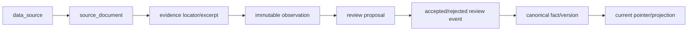

# Aerospace Supplier Intelligence — Architecture

## Status

This document fixes intended boundaries and invariants. It does not claim the described services are deployed or complete. Implementation status belongs in observed verification, not aspirational prose.

## System context

Aerospace Supplier Intelligence is an independent web and worker system backed by PostgreSQL and durable document storage. Saucer and Almanac are reference lessons only: there are no imports, runtime calls, shared credentials, databases, queues, or volumes.

```mermaid
flowchart LR
  U[Authenticated user] --> W[apps/web]
  W --> DB[(PostgreSQL 17)]
  W --> S[Durable STORAGE_PATH]
  W --> Q[pg-boss in PostgreSQL]
  Q --> K[apps/worker]
  K --> DB
  K --> S
  K --> R[packages/research]
  R --> O[OpenRouter]
  R --> H[Policy-limited HTTP(S)]
```

PostgreSQL is authoritative for identities, canonical facts, observations, reviews, audit, jobs, and workflow state. Durable storage is authoritative for document bytes; the database stores their relative object keys and digests. SSE is a reconnectable view of persisted progress, not an in-memory source of truth.

## Workspace boundaries

| Workspace                               | Owns                                                                                                      | Must not own                                                                                 |
| --------------------------------------- | --------------------------------------------------------------------------------------------------------- | -------------------------------------------------------------------------------------------- |
| `apps/web` / `@asi/web`                 | App Router UI, auth boundary, `/api/v1`, route handlers, authenticated SSE                                | Background execution, model secrets in client code, domain schemas duplicated from contracts |
| `apps/worker` / `@asi/worker`           | `pg-boss` lifecycle, job dispatch, durable run transitions                                                | Browser/API presentation, process-local authoritative state                                  |
| `packages/contracts` / `@asi/contracts` | Zod domain/API schemas, enum tuples, envelopes, OpenAPI inputs                                            | Database imports, I/O, secrets                                                               |
| `packages/database` / `@asi/database`   | Drizzle schema/client, `pg` pool, transactions, repositories, migration support                           | HTTP/UI concerns, contract ownership                                                         |
| `packages/research` / `@asi/research`   | OpenRouter adapter, model router, safe tools/catalog, workflows, pure scoring and entity-resolution logic | Direct canonical writes, unbounded agents, mutable global registries                         |
| `packages/config` / `@asi/config`       | Runtime env parsing, defaults, browser/server boundary                                                    | Feature logic, secret persistence                                                            |
| `packages/ui` / `@asi/ui`               | Restrained accessible visual primitives                                                                   | Business entities, data access, authorization                                                |

Dependency direction is contracts/config → database/research/UI → apps. Database may import contract enum tuples; contracts never imports database. UI primitives remain independent of database and server secrets.

## Public and asynchronous interfaces

- REST paths are under `/api/v1` and validate input/output with shared contracts.
- Success envelope: `{ "data": value, "meta"?: value }`.
- Error envelope: `{ "error": { "code": string, "message": string, "details"?: value } }`.
- OpenAPI 3.1 describes the same runtime schemas; it is not a separate handwritten truth.
- Jobs carry a schema version, job kind, UUID target/run IDs, actor/request correlation, idempotency key, and bounded policy. Payloads contain identifiers, not document bytes or credentials.
- Worker outcomes are persisted transactionally. Delivery is at least once; handlers must be idempotent. “Exactly once” is not an architecture claim.
- SSE requires authentication and emits projections keyed by durable run/event IDs. Reconnect reads current persisted state.

## Canonical data and provenance

Canonical business entities are normalized relational records. JSONB is limited to raw values, model payloads, structured metadata, and replay/tool artifacts; it is not a substitute for searchable entities.



Invariants:

1. `data_source` describes a recurring publisher, registry, database, or origin. It is independent and may have zero company links.
2. `source_document` is a particular retrieved/uploaded artifact with immutable digest and retrieval metadata; it is never the recurring source.
3. Important uncertain values enter as append-only observations. Rejection, supersession, or canonical replacement does not delete them.
4. A proposal previews a candidate change. An append-only review event records actor, time, decision, and reason. Only acceptance may advance a canonical current pointer.
5. Canonical replacement creates lineage; it does not rewrite the historical fact or review.
6. `audit_events` are append-only. Entity merges persist reversible events/snapshots; fuzzy similarity alone never performs a merge.
7. Certifications are broad credentials. Qualifications attach at Facility × Part × Platform/Variant × Subsystem × Customer × Time wherever known; a broad certification cannot prove a specific qualification.
8. Source and target scoring dimensions are nullable. Missing is `null`, reduces evidence completeness, and never silently becomes zero.

Concurrent reviewers use transactions and expected-current/version checks. A stale review produces a visible conflict and must be reconsidered; last-write-wins is not acceptable for canonical selection.

## Documents and ingestion

Authorized uploads and policy-permitted retrieval first write a staged file, compute SHA-256 over the stored canonical bytes, validate size/type, then atomically promote to a content-addressed durable key and persist metadata. Identical content is idempotent. Reads verify key/digest assumptions. Absolute host paths do not cross APIs.

Public HTTP(S) tools resolve DNS and reject localhost, loopback, private, link-local, multicast/reserved addresses before connecting and after every redirect. Redirect count, wall time, response bytes, and content types are bounded. The stored final URL and access time describe what was actually retrieved.

Restricted/paywalled sources are metadata-only unless an authenticated user supplies material they are authorized to use. The system must never report that inaccessible content was searched.

## Research architecture

Research is a bounded queued workflow, not a giant autonomous agent:

1. **Intent artifact:** validated target, requested questions, actor, policy/budget.
2. **Plan artifact:** ordered, bounded stages referencing only registered tool IDs and declared input/output mappings.
3. **Execution artifacts:** validated tool/model input/output, timestamps, hashes, durable source links, costs, status, and errors.
4. **Proposal artifact:** evidence-linked observations and candidate canonical changes.
5. **Presentation artifact:** a user-facing summary that distinguishes reviewed facts, source claims, proposals, unknowns, and failures.

The tool catalog declares capability, schemas, permission class, timeout, byte/redirect limits, retry classification, and handler identity. The executor enforces the catalog; a manifest alone provides no security. The catalog is built deterministically at process start and is not a request-mutable global.

The model gateway is the single OpenRouter boundary. It performs model routing, Zod-structured output validation, budgets, timeouts, cost/provenance capture, and retry classification. `OPENROUTER_API_KEY` is read only from process environment and is never logged, persisted, returned to clients, or included in prompts.

Only transient 429/5xx/network/timeout failures are retryable. Retries honor `Retry-After`, add capped jitter, and obey attempt/time/cost limits. Quota exhaustion, policy denial, schema failure after its allowed repair, and failed final postconditions are durable failures—not best-effort success.

Fetched and model text is untrusted evidence, never instructions. It cannot modify system policy, tool permissions, budgets, or secrets. Research produces observations/proposals, never direct canonical writes.

## Agent runtime

Continuous research agents (`research_agents`/`agent_ticks`, migration `0003_agent_runtime.sql`) run beside the queued campaign workflow above. The LLM proposes; deterministic code verifies and executes.

**Supervisor** (`apps/worker/src/supervisor/supervisor.ts`): one long-lived loop inside the worker process, started at `apps/worker/src/index.ts` unless `AGENT_SUPERVISOR_ENABLED=false`. Constants: poll every 5s, lease 90s, heartbeat every 15s during a tick, tick wall time 60s, max 4 concurrent agents. Due `running` agents are claimed with `FOR UPDATE SKIP LOCKED` plus a stale-lease predicate (`packages/database/src/agents/registry.ts`), so a crashed worker's lease is reclaimed by any live instance without human intervention. Failures back off exponentially (15m × 2^n, capped at 24h) in `packages/database/src/agents/ticks.ts`; graceful stop aborts in-flight ticks and journals them `preempted` without a failure penalty.

**Tick lifecycle**: journal row → heartbeats → registered type handler bounded by wall time → outcome journalled (`executed`/`done`/`stuck`/`budget_exhausted`/`error`/`preempted`) → cadence or backoff sets `next_tick_at` → lease released. Every persisted fact still flows through the existing provenance chain (observations/proposals), never direct canonical writes.

**Planning**: per-agent-type Zod action manifests live in `packages/research/src/campaigns/planner-step.ts` (`agent_plan_v1`, ≤10 actions per batch); invalid plans get one repair retry, then a recorded `stuck` outcome. The v1 handler registry (`apps/worker/src/supervisor/handlers.ts`) is a passthrough no-op for all five types until real executors land.

**Budgets**: the global daily cap (`OPENROUTER_MAX_COST_PER_DAY_USD`, default $1 via `dailyBudgetCapUsd` in `packages/research/src/campaigns/budget.ts`) is checked each poll against the `model_usage` sum since UTC midnight; an unreadable spend read fails safe by parking, never by spending. Each agent is additionally capped by `budget_share_pct` of that cap and/or an absolute `daily_budget_usd` (the lower applies, `agentDailyBudgetUsd` in `apps/worker/src/supervisor/supervisor.ts`); tick `cost_usd` accumulates into `spend_today_usd`. Crossing either parks the agent (`budget_exhausted`, far-future `next_tick_at` just past UTC midnight).

**Registry seeding status**: the six §1.3 default agent rows are NOT seeded automatically yet; agents are created at runtime through the control-plane API below.

**Control plane** (`apps/web/src/app/api/v1/agents/`): authenticated reads — `GET /api/v1/agents` (list + aggregates), `GET /api/v1/agents/overview`, `GET /api/v1/agents/:id`, `GET /api/v1/agents/:id/ticks`; admin mutations with CSRF and `audit_events` rows — `POST /api/v1/agents`, `PATCH /api/v1/agents/:id` (admin), `POST /api/v1/agents/:id/pause|resume` (analyst or admin), `POST /api/v1/agents/:id/kill` (admin, reason required).

## Authentication and authorization

Every route except `/login`, `/api/v1/auth/login`, and health checks requires authentication. Roles are `admin`, `analyst`, and `viewer`; authorization is enforced server-side at the operation, with CSRF checks on mutations.

Passwords use Argon2id. Session tokens are cryptographically random; only SHA-256 token hashes persist. Cookies are secure, httpOnly, and sameSite=lax. Expired/revoked sessions and disabled users fail closed. Secrets stay server-only.

Audit records cover authentication, mutation, review, merge, import, research administration, and authorization-sensitive administration without storing raw passwords, tokens, API keys, or unnecessary contact/document content.

## Database rules

- Plural snake_case table names; UUID primary keys; TypeScript camelCase.
- `created_at`/`updated_at` are timezone-aware timestamps. Append-only records have creation/event time and no application update path.
- Foreign keys declare delete behavior. Evidence-bearing records default to restrict or preserve-history semantics rather than cascaded loss.
- Calendar dates use `date`; instants use `timestamptz`.
- Money is numeric amount plus ISO 4217 currency; never floating point.
- Uncertain numeric/time values preserve lower and upper bounds and their inclusivity/precision.
- Confidence is numeric in `[0,1]`. Source/target scoring components are nullable numeric values in `[0,100]`.
- Database checks enforce ranges and immutable/history invariants where PostgreSQL can enforce them; repositories reinforce them and verify digests/lineage.

## Failure and consistency model

- Database transactions contain each canonical selection, review event, merge event, and enqueue boundary that must be atomic.
- External HTTP/model/storage work does not hold a database transaction open. It writes durable attempt state before/after the call and reconciles idempotently.
- Queue delivery is at least once. Stable idempotency keys and unique constraints prevent duplicate side effects.
- Partial research is retained as failed/partial artifacts with error class; it is never relabeled complete.
- Process memory may cache immutable configuration or derived data but is never authoritative for registry, trace, rate limit, job, session, review, or workflow state.

## Reference lessons and claim discipline

Saucer demonstrates useful patterns: immutable content and successor chains enforced below the service layer, read-time digest verification, structured LLM calls with budgets/provenance, durable keyed failure handling for jobs, evidence-first/local-first search, and bounded transient retries. This architecture adopts those principles, not its runtime or process-local quota state.

Almanac demonstrates useful typed stage artifacts, catalog-planned tools, and proposal preview/approval/version promotion. This architecture requires the missing enforcement: runtime schemas, populated durable hashes/cost/model fields, executor-enforced permissions/timeouts/retries, actor and reason, content IDs, and append-only audit. Mutable singleton registries, global request traces, process-local stores, timestamp-only identities, and documentation-only replay claims are prohibited.

A guarantee may move from “planned” to “implemented” only when the named database constraint/repository/executor/API and an observed end-to-end check enforce it.
